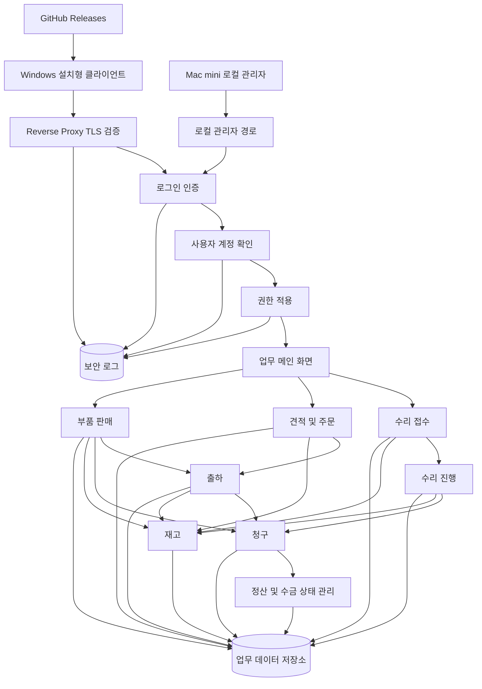

# 시스템 아키텍처

태그: `#erp` `#domain/architecture` `#doc/core`

상위 문서: [문서 지도](../00-index.md)  
이전 문서: [문서 지도](../00-index.md)  
다음 문서: [배포 및 저장 구조](02-deployment-and-storage-architecture.md)

문서 위치: [문서 지도](../00-index.md) > 아키텍처

관련 문서:
- [배포 및 저장 구조](02-deployment-and-storage-architecture.md)
- [데이터 모델 기초 설계](03-data-model-foundation.md)
- [보안 운영 요약](../security/01-security-operations-summary.md)
- [로그인 인증](../security/02-login-authentication.md)
- [권한 모델](../security/04-permission-model.md)
- [수리 접수 워크플로우](../workflows/01-repair-intake-workflow.md)
- [재고 워크플로우](../workflows/05-inventory-workflow.md)
- [개발 워크플로우](../01-development-workflow.md)

## 1. 목적

이 문서는 ERP 시스템의 전체 구성과 주요 컴포넌트 간 관계를 정리하기 위한 아키텍처 문서이다.

## 2. 시스템 개요

- Windows 설치형 Electron 클라이언트가 일반 사용자 접점을 담당한다.
- 인증, 사용자, 권한 정책은 보안 계층에서 통제한다.
- 업무 모듈은 수리, 판매, 견적, 청구, 재고, 출하로 나뉜다.
- 모든 업무 데이터는 공통 데이터 저장소와 연계된다.
- 향후 외부 서비스 연동은 택배, 메시지, 세금계산, 인증 서비스 중심으로 확장한다.

## 3. 전체 구조 흐름도

## 4. 주요 컴포넌트

### 4.1 사용자 인터페이스

- 화면 구성
- 사용자 입력 처리

### 4.2 업무 로직

- 수리
- 판매
- 견적 및 주문
- 재고

### 4.3 데이터 계층

- 데이터 저장 방식
- 주요 엔터티
- 백업 및 복구 방안

## 5. 계층별 설명

### 5.1 클라이언트 계층

- Windows 사용자는 설치형 Electron 클라이언트로 ERP 로그인, 메뉴 진입, 업무 입력 화면을 사용한다.
- 관리자는 Mac mini 현지 브라우저에서만 관리자 전용 화면을 사용한다.
- 내부망과 외부망 접속 정책은 로그인 단계에서 먼저 통제된다.

### 5.2 보안 계층

- reverse proxy 또는 TLS 계층이 mTLS 검증을 수행하고, 앱 계층은 그 검증 결과를 신뢰한다.
- 로그인 인증 문서 기준으로 계정 검증, 2차 인증, 세션 발급을 수행한다.
- 사용자 관리 문서 기준으로 계정 상태와 소속 정보를 관리한다.
- 권한 모델 문서 기준으로 화면, 기능, 승인 범위를 제한한다.

### 5.3 업무 계층

- 수리 접수와 수리 진행은 서비스 업무 축이다.
- 견적 및 주문, 부품 판매는 영업 업무 축이다.
- 청구서, 재고, 출하는 공통 지원 업무 축이다.

### 5.4 데이터 계층

- 고객, 품목, 재고, 주문, 수리, 청구, 사용자 데이터를 저장한다.
- 각 업무는 상태값과 이력 중심으로 저장해 추적 가능해야 한다.
- PostgreSQL 관계형 저장소와 로컬 파일 저장소를 분리해 운영한다.

## 6. 데이터 흐름

- 사용자 요청 발생
- 업무 로직 처리
- 데이터 저장 및 조회
- 결과 반환

## 7. 핵심 엔터티 후보

- 사용자
- 역할
- 권한
- 고객
- 품목
- 재고
- 수리 접수
- 수리 작업
- 견적
- 주문
- 청구서
- 출하

## 8. 문서 연결 기준

- 보안 설계는 [로그인 인증](../security/02-login-authentication.md), [사용자 관리](../security/03-user-management.md), [권한 모델](../security/04-permission-model.md)을 함께 본다.
- 배포와 데이터 저장 규칙은 [배포 및 저장 구조](02-deployment-and-storage-architecture.md), [데이터 모델 기초 설계](03-data-model-foundation.md)를 함께 본다.
- Windows 설치 파일 배포와 업데이트 정책은 GitHub Releases를 기준 채널로 사용한다.
- 수리 흐름은 [수리 접수 워크플로우](../workflows/01-repair-intake-workflow.md), [수리 진행 워크플로우](../workflows/02-repair-process-workflow.md)로 이어진다.
- 영업 및 물류 흐름은 [견적 및 주문 워크플로우](../workflows/03-quotation-order-workflow.md), [부품 판매 워크플로우](../workflows/04-parts-sales-workflow.md), [출하 워크플로우](../workflows/06-shipping-workflow.md), [청구서 워크플로우](../workflows/07-invoice-workflow.md), [재고 워크플로우](../workflows/05-inventory-workflow.md)와 연결된다.

## 9. 향후 보완 항목

- 모듈 간 의존성 다이어그램
- 장애 대응 구조
