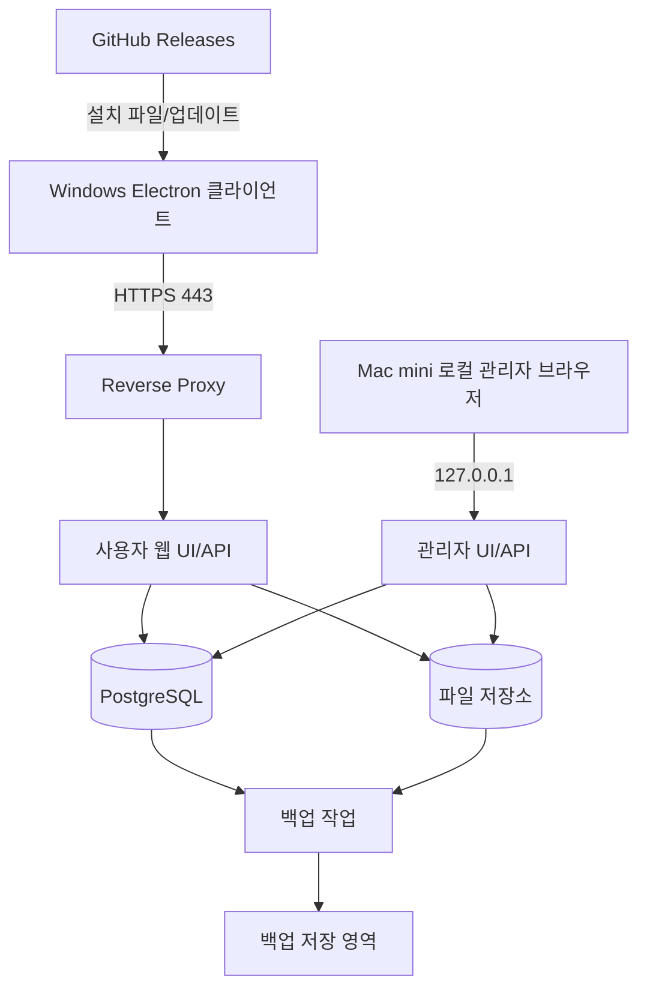

# 배포 및 저장 구조

태그: `#erp` `#domain/architecture` `#topic/deployment` `#topic/storage`

상위 문서: [문서 지도](../00-index.md)  
이전 문서: [시스템 아키텍처](01-system-architecture.md)  
다음 문서: [데이터 모델 기초 설계](03-data-model-foundation.md)

문서 위치: [문서 지도](../00-index.md) > 아키텍처 > 배포 및 저장 구조

관련 문서:
- [시스템 아키텍처](01-system-architecture.md)
- [로그인 인증](../security/02-login-authentication.md)
- [보안 운영 요약](../security/01-security-operations-summary.md)
- [권한 모델](../security/04-permission-model.md)
- [데이터 모델 기초 설계](03-data-model-foundation.md)

## 1. 목적

이 문서는 Mac mini 단일 서버 환경에서 ERP 시스템의 물리 배치, 접근 경로, 데이터 저장 위치, 백업 단위를 정의한다.

## 2. 운영 전제

- ERP 서버는 Mac mini 한 대에서 구동한다.
- 관리자는 서버가 설치된 Mac mini 현지에서만 접속할 수 있다.
- 일반 사용자는 Windows PC에 설치한 Electron 클라이언트로 접속한다.
- 일반 사용자 접속은 VPN 없이 인터넷 구간을 통과할 수 있으며, [로그인 인증](../security/02-login-authentication.md) 문서 기준으로 MFA를 적용한다.
- 주 데이터 저장소는 PostgreSQL을 사용한다.
- 첨부 파일은 DB BLOB이 아니라 서버 로컬 파일 저장소에 보관한다.
- Windows 클라이언트 설치 파일과 버전 배포는 GitHub Releases를 사용한다.
- 서버 코드는 Mac mini에서 직접 업데이트하고, 클라이언트는 GitHub Releases로 업데이트한다.

## 3. 물리 배치 개요



## 4. 프로세스 배치

### 4.1 외부 공개 프로세스

- `reverse proxy`
  - 외부 공개 포트는 `443`만 사용한다.
  - TLS 종료, mTLS 인증서 검증, 검증 결과 전달, 공개 라우팅 제어를 담당한다.
- `erp-web`
  - 일반 사용자용 API와 클라이언트 연동 엔드포인트를 제공한다.
  - Windows 설치형 클라이언트는 이 경로로만 접속한다.

### 4.2 로컬 전용 프로세스

- `erp-admin`
  - 관리자 UI와 관리자 전용 API를 제공한다.
  - `127.0.0.1` 또는 로컬 소켓만 바인딩한다.
  - 외부 reverse proxy 라우팅에 포함하지 않는다.
- `postgresql`
  - 외부 공개 금지
  - 애플리케이션 프로세스와 로컬 운영자만 접근한다.

### 4.3 저장 및 보조 프로세스

- `file storage`
  - 사진, 견적서 PDF, 청구서 PDF, 송장 이미지, 업무 첨부를 저장한다.
- `backup worker`
  - DB dump, WAL 보관, 파일 증분 백업, 로그 순환을 수행한다.

### 4.4 서버 실행 방식

- 현재 운영 기준 서버 실행 명령은 아래와 같다.

```bash
cd "/Users/glory_ai_sever/Desktop/erp porject"
npm run start:db:local
```

- 이 명령은 로컬 PostgreSQL `sunjin_erp` DB를 사용하는 개발/초기 운영 기준 실행 방식이다.
- 현재 단계에서는 Mac mini 운영자가 직접 재시작한다.
- 향후 운영 안정화 단계에서는 `pm2` 또는 `launchd` 기반 상시 서비스로 전환한다.

## 5. 접근 경로 분리 원칙

### 5.1 관리자 경로

- 관리자 기능은 Mac mini 현지 접속만 허용한다.
- 관리자 UI는 로컬 브라우저 또는 로컬 앱 WebView에서만 사용한다.
- 관리자 URL은 외부 DNS 또는 공용 URL에 노출하지 않는다.
- 사용자 관리, 권한 변경, 보안 정책 변경, 감사 로그 조회 같은 민감 기능은 관리자 경로에만 둔다.

### 5.2 일반 사용자 경로

- 일반 사용자는 공개 HTTPS 엔드포인트로 접속한다.
- Electron 클라이언트는 인증서 원문을 앱 서버에 직접 전달하지 않고, reverse proxy가 인증서 검증 결과를 앱 서버 컨텍스트로 넘긴다.
- 로그인 시 세션에는 아래 요소를 함께 반영한다.
  - 인증서 식별자
  - 단말 식별자
  - 사용자 계정 상태
  - MFA 결과
  - 접속 위치
- 외부 사용자 세션은 [로그인 인증](../security/02-login-authentication.md) 문서의 외부망 정책을 따른다.

관리자 로컬 경로:

- 관리자 UI는 로컬 브라우저에서만 사용하며 배포 경계로 보호한다.
- 관리자 경로도 동일한 디자인 시스템을 사용하지만 접근 허용은 라우트 노출이 아니라 로컬 바인딩으로 통제한다.

### 5.3 클라이언트 배포 경로

- Windows 설치 파일은 GitHub Releases 아티팩트로 배포한다.
- 클라이언트는 앱 시작 시 GitHub Releases 최신 버전을 확인한다.
- 새 버전이 있으면 자동 다운로드 후 재시작 시 적용하는 구조를 목표로 한다.
- 초기 배포는 무서명 내부 테스트용으로 시작하며 SmartScreen 경고 가능성을 운영 절차에 포함한다.

### 5.4 서버 패치 경로

- 서버 패치는 Mac mini에서 직접 수행한다.
- 일반적인 패치 순서는 아래와 같다.

```bash
git pull origin main
npm install
npm run db:migrate
npm run start:db:local
```

- 서버 패치는 항상 클라이언트 릴리즈보다 먼저 수행한다.
- DB 스키마 변경이 포함된 버전은 `db:migrate`를 건너뛰지 않는다.

## 6. 저장소 디렉터리 구조

권장 루트:

```text
/srv/erp/
  app/
  data/
    postgres/
    files/
      tmp/
      quarantine/
      repair/
      quotation/
      order/
      sale/
      shipment/
      invoice/
      customer/
    backups/
      db/
      files/
  logs/
```

### 6.1 디렉터리 역할

- `app/`: 애플리케이션 실행 파일과 설정
- `data/postgres/`: PostgreSQL 데이터 파일
- `data/files/tmp/`: 업로드 직후 임시 저장 영역
- `data/files/quarantine/`: 검사 실패 또는 보류 파일 격리 영역
- `data/files/<domain>/`: 업무별 본 저장 영역
- `data/backups/db/`: DB dump 및 보관 파일
- `data/backups/files/`: 파일 저장소 백업
- `logs/`: 애플리케이션 및 운영 로그

## 7. 파일 저장 규칙

### 7.1 저장 경로 규칙

- 실제 파일 경로는 아래 규칙으로 통일한다.

```text
{domain}/{year}/{month}/{entity-id}/{file-id}-{version}.{ext}
```

예시:

```text
repair/2026/03/repair-intake-123/file-987-v1.jpg
invoice/2026/03/invoice-502/file-122-v2.pdf
```

### 7.2 업로드 처리 흐름

1. 사용자가 파일 업로드 요청
2. `tmp/`에 임시 저장
3. 파일 크기, 확장자, MIME, 해시, 악성 여부 검사
4. 통과 시 본 저장소로 이동
5. DB에 메타데이터 저장
6. 실패 시 `quarantine/`으로 이동 또는 즉시 폐기

### 7.3 다운로드 처리 원칙

- 파일 직접 URL 노출 금지
- 애플리케이션이 권한을 검사한 후 스트리밍 방식으로 다운로드 제공
- 파일 경로 자체를 사용자 입력 또는 외부 파라미터로 신뢰하지 않는다

## 8. 백업 및 복구 구조

### 8.1 백업 단위

- PostgreSQL 논리 백업과 WAL 보관
- 파일 저장소 증분 백업
- 애플리케이션 설정 백업

### 8.2 백업 원칙

- DB와 파일 백업은 같은 배치 작업에서 수행한다.
- 복구 시점은 `DB 시점 + 파일 스냅샷 시점`을 함께 관리한다.
- 최소 일 단위 전체 백업과 더 짧은 주기의 증분 또는 WAL 보관을 적용한다.

### 8.3 복구 목표

- 사용자 계정, 세션, 감사 로그, 업무 데이터, 첨부 파일 간 연결이 복구 후에도 유지돼야 한다.
- 수리, 주문, 판매, 출하, 청구 문서의 첨부 참조가 유실되지 않아야 한다.

## 9. 보안 제약

- DB는 외부 네트워크에 공개하지 않는다.
- 관리자 경로는 외부 공개 라우팅에서 제외한다.
- 파일 저장소는 웹 루트 밖에 둔다.
- 민감 기능은 [권한 모델](../security/04-permission-model.md) 기준 권한 확인과 재인증 정책을 함께 적용한다.
- 인증서 폐기, 계정 비활성, 권한 박탈 이벤트 발생 시 세션 강제 종료와 감사 로그 기록이 가능해야 한다.

## 10. 운영 체크포인트

- 관리자 기능이 외부 PC에서 열리지 않는가
- 일반 사용자 Electron 클라이언트 접속이 HTTPS 단일 경로로 정리되는가
- PostgreSQL과 파일 저장소가 외부 직접 접근에서 차단되는가
- 업로드 임시 영역과 격리 영역이 분리되는가
- DB와 파일을 함께 복구할 수 있는 백업 체계가 준비되는가
- 서버 패치가 Mac mini에서 수동 반영되고 있는가
- 클라이언트 릴리즈 자산(`.exe`, `latest.yml`, blockmap)이 GitHub Releases에 함께 게시되는가
- GitHub Releases 설치 파일과 현재 운영 버전이 일치하는가

## 11. 향후 보완 항목

- reverse proxy 상세 라우팅 규칙
- 운영체제 계정과 서비스 권한 분리
- 백업 보관 주기 및 오프사이트 복제 정책
