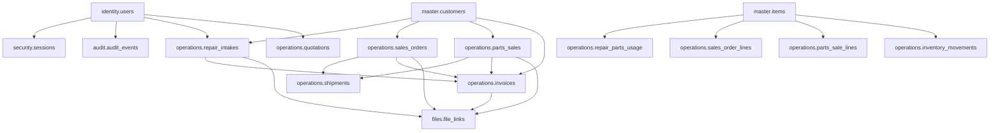

# 데이터 모델 기초 설계

태그: `#erp` `#domain/architecture` `#topic/data-model` `#doc/design`

상위 문서: [문서 지도](../00-index.md)  
이전 문서: [배포 및 저장 구조](02-deployment-and-storage-architecture.md)  
다음 문서: [보안 운영 요약](../security/01-security-operations-summary.md)

문서 위치: [문서 지도](../00-index.md) > 아키텍처 > 데이터 모델 기초 설계

관련 문서:
- [시스템 아키텍처](01-system-architecture.md)
- [배포 및 저장 구조](02-deployment-and-storage-architecture.md)
- [로그인 인증](../security/02-login-authentication.md)
- [사용자 관리](../security/03-user-management.md)
- [권한 모델](../security/04-permission-model.md)
- [재고 워크플로우](../workflows/05-inventory-workflow.md)

## 1. 목적

이 문서는 PostgreSQL 기반 ERP 데이터 구조의 기본 스키마 경계, 핵심 테이블 묶음, 공통 설계 규칙을 정의한다.

## 2. 설계 원칙

- 본 설계의 주 DB 엔진은 PostgreSQL이다.
- 핵심 업무 데이터는 정규화된 관계형 구조로 저장한다.
- 상태가 변하는 엔터티는 본문 테이블과 이력 또는 이벤트 테이블을 분리한다.
- 승인, 예외, 민감 작업은 별도 기록 가능 구조로 설계한다.
- 물리 삭제보다 상태 전이를 우선한다.
- 파일 본문은 DB 밖 파일 저장소에 두고, DB에는 메타데이터와 참조만 저장한다.
- 감사 로그는 조회 최적화보다 불변성, 추적성을 우선한다.

## 3. 스키마 분리

| 스키마 | 역할 |
| --- | --- |
| `identity` | 사용자, 부서, 역할, 권한, 인증서, 승인 단말 |
| `security` | 로그인 시도, MFA, 세션, 잠금, 재인증, 예외 로그인 |
| `audit` | 감사 이벤트, 상태 변경, 권한 변경, 관리자 작업 추적 |
| `master` | 고객, 거래처, 품목, 제품, 창고, 로케이션, 기준정보 |
| `operations` | 수리, 견적, 주문, 판매, 출하, 청구, 재고 원장 |
| `files` | 파일 객체, 버전, 연결 대상, 보존 정책 |

## 4. 공통 컬럼 기준

모든 핵심 본문 테이블은 아래 공통 컬럼을 기본으로 가진다.

- `id`
- `code` 또는 `number`
- `status`
- `created_at`
- `created_by`
- `updated_at`
- `updated_by`

필요 시 추가 공통 컬럼:

- `approved_at`
- `approved_by`
- `approval_reason`
- `cancelled_at`
- `cancelled_by`
- `cancel_reason`

## 5. 핵심 데이터 영역

### 5.1 사용자 및 권한

주요 테이블:

- `identity.users`
- `identity.departments`
- `identity.roles`
- `identity.permissions`
- `identity.user_roles`
- `identity.role_permissions`
- `identity.user_status_history`
- `identity.credential_certificates`
- `identity.approved_devices`

설계 기준:

- 사용자 상태는 `승인대기`, `활성`, `잠금`, `비활성` 전이를 추적 가능해야 한다.
- 인증서는 사용자 또는 승인 단말에 매핑돼야 한다.
- 역할 기반 권한과 예외 권한을 함께 수용할 수 있어야 한다.

### 5.2 보안 및 세션

주요 테이블:

- `security.sessions`
- `security.login_attempts`
- `security.mfa_challenges`
- `security.reauth_events`
- `security.account_locks`
- `security.exception_logins`

설계 기준:

- 일반 사용자 세션은 인증서 식별자, 단말 식별자, 계정 상태, MFA 결과, 접속 위치를 포함해야 한다.
- 외부망 세션과 내부망 세션은 만료 정책을 구분할 수 있어야 한다.
- 인증 실패 누적, 잠금, 잠금 해제, 예외 로그인 승인 이력이 남아야 한다.
- 사용자 개인 설정은 `identity.user_preferences`에 저장한다.
- 개인 설정은 로그인 후 기본 탭, 화면 밀도, 최근 로그인 아이디 표시 여부, 테스트 접속 범위 같은 사용자 선호만 포함한다.
- 자동 로그인 세션 저장 여부는 장치 로컬 설정이므로 서버 개인 설정에 포함하지 않는다.

### 5.3 기준 정보

주요 테이블:

- `master.customers`
- `master.customer_contacts`
- `master.customer_addresses`
- `master.customer_assets`
- `master.customer_equipments`
- `master.vendors`
- `master.items`
- `master.item_categories`
- `master.item_serials`
- `master.warehouses`
- `master.stock_locations`

설계 기준:

- 고객과 거래처는 연락처, 주소, 메모, 사용 상태를 분리 관리할 수 있어야 한다.
- 고객 자산은 선박과 운용 장비를 분리해 추적하며, 선박 목록과 장비 목록은 화면에서도 독립 목록으로 다룬다.
- 등록 완료된 고객 기본정보는 단일 필드 수정 이력을 남길 수 있게 필드 단위 업데이트를 허용한다.
- 시리얼 또는 유효기간 관리 대상 품목은 별도 추적 테이블을 둔다.
- 창고와 로케이션을 분리해 재고 이동을 기록할 수 있어야 한다.

### 5.4 수리 도메인

- `operations.repair_intakes`
- `operations.repair_items`
- `operations.repair_diagnostics`
- `operations.repair_work_orders`
- `operations.repair_parts_usage`
- `operations.repair_events`

설계 기준:

- 접수 정보, 제품 정보, 증상, 진단, 작업 결과를 구간별로 분리 저장한다.
- 수리 사용 부품은 재고 원장과 연결 가능해야 한다.
- 수리 완료, 보류, 수리 불가 같은 상태 전이를 추적해야 한다.

### 5.5 견적, 주문, 판매

- `operations.quotations`
- `operations.quotation_versions`
- `operations.quotation_lines`
- `operations.sales_orders`
- `operations.sales_order_lines`
- `operations.parts_sales`
- `operations.parts_sale_lines`
- `operations.sales_returns`

설계 기준:

- 견적은 버전 관리가 가능해야 한다.
- 주문과 판매는 라인 구조를 사용해 부분 출하, 부분 청구를 지원해야 한다.
- 가격 예외나 승인 필요한 거래는 승인 정보와 사유를 보관해야 한다.
- 주문은 선사, 선박, 장비, 요청 구분, 견적 범위, 수주 확정 여부를 추적해야 한다.
- 수주 확정 시 공사 또는 일반 판매/납품 구분에 따라 `SH-YYYY-NNN-T/S` 관리번호를 부여할 수 있어야 한다.

### 5.6 출하 및 청구

- `operations.shipments`
- `operations.shipment_lines`
- `operations.shipment_tracking_events`
- `operations.invoices`
- `operations.invoice_lines`
- `operations.receipts`
- `operations.accounts_receivable_events`

설계 기준:

- 출하는 주문 또는 판매를 참조하되 부분 출하를 허용해야 한다.
- 청구는 수리, 주문, 판매 중 어느 원거래에서 왔는지 추적 가능해야 한다.
- 청구 시점의 금액과 세부 라인은 원거래 변경과 독립적으로 보존돼야 한다.

### 5.7 재고 원장

- `operations.inventory_movements`
- `operations.inventory_balances`
- `operations.inventory_adjustments`

설계 기준:

- 입고, 출고, 이동, 조정, 수리 사용, 판매 출고를 단일 원장 구조로 기록한다.
- `inventory_movements`는 사실 원장, `inventory_balances`는 조회 최적화용 현재고 캐시로 둔다.
- 현재고는 원장 합산으로 재계산 가능해야 한다.
- 음수 재고는 정책적으로 차단 가능해야 한다.

## 6. 파일 메타데이터 구조

주요 테이블:

- `files.file_objects`
- `files.file_versions`
- `files.file_links`

권장 메타데이터 항목:

- `file_id`
- `domain`
- `entity_type`
- `entity_id`
- `original_name`
- `stored_path`
- `mime_type`
- `size_bytes`
- `sha256`
- `version`
- `uploaded_by`
- `uploaded_at`
- `scan_status`
- `retention_class`

설계 기준:

- 하나의 업무 엔터티에 여러 파일 연결 가능
- 같은 파일의 버전 이력 관리 가능
- 실제 파일 경로는 [배포 및 저장 구조](02-deployment-and-storage-architecture.md) 문서의 규칙을 따른다

## 7. 관계 구조 요약

## 8. 감사 및 이력 설계

### 8.1 감사 대상

- 로그인 성공 및 실패
- 계정 잠금 및 해제
- 사용자 생성, 상태 변경, 비활성 처리
- 권한 변경
- 예외 로그인 승인
- 민감 기능 재인증
- 승인 처리와 상태 확정

### 8.2 이력 분리 원칙

- 상태 이력은 도메인별 `*_events` 또는 `*_status_history` 테이블에 저장한다.
- 감사 로그는 업무 본문과 분리된 `audit` 스키마에 저장한다.
- 감사 로그는 append-only에 가깝게 운영한다.

## 9. 제약과 기본 정책

- 모든 외래키는 실제 업무 연결을 보장해야 한다.
- 수치 금액은 정밀 소수 타입을 사용한다.
- 시간 정보는 타임존 처리 가능한 타입 기준으로 저장한다.
- 상태값 표준은 다음 상세 설계 단계에서 도메인별 enum으로 확정한다.
- MFA 방식, 공용 도메인 운영 방식, 인증서 발급 운영은 후속 문서에서 상세화한다.

## 10. 검토 체크포인트

- 계정 상태 차단과 세션 강제 종료를 지원하는가
- 권한 변경과 승인 이력을 분리 기록할 수 있는가
- 수리, 주문, 판매, 출하, 청구를 하나의 고객/품목 기준으로 추적 가능한가
- 재고 원장만으로 현재고 재계산이 가능한가
- 청구와 첨부 파일이 원거래와 연결되는가

## 11. 향후 보완 항목

- 도메인별 상태값 표준 정의
- 실제 DDL 초안
- 인덱스 및 파티셔닝 전략
