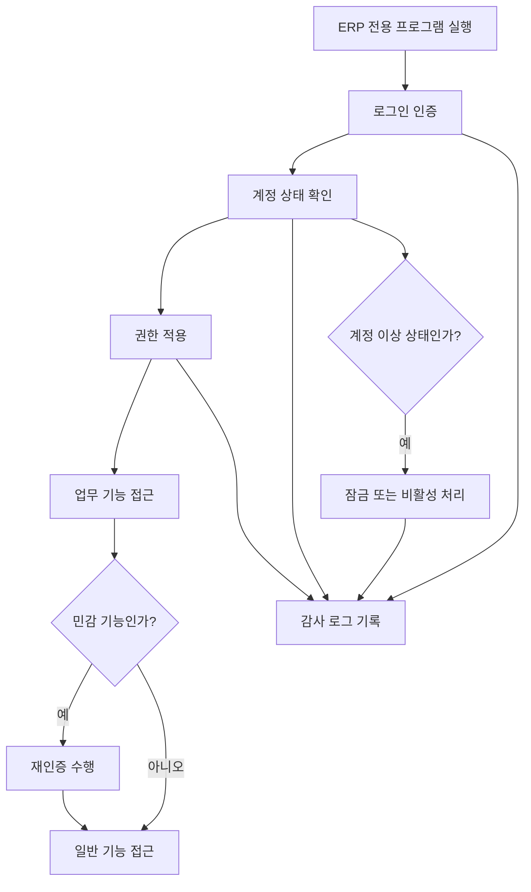

# 보안 운영 요약

태그: `#erp` `#domain/security` `#hub/security` `#doc/summary`

상위 문서: [문서 지도](../00-index.md)  
이전 문서: [시스템 아키텍처](../architecture/01-system-architecture.md)  
다음 문서: [로그인 인증](02-login-authentication.md)

문서 위치: [문서 지도](../00-index.md) > 보안 > 보안 운영 요약

관련 문서:
- [보안 구현 우선순위](05-security-implementation-priority.md)
- [로그인 인증](02-login-authentication.md)
- [사용자 관리](03-user-management.md)
- [권한 모델](04-permission-model.md)
- [시스템 아키텍처](../architecture/01-system-architecture.md)

## 1. 목적

이 문서는 ERP 보안 운영 정책의 핵심 내용을 한 문서에서 빠르게 파악하기 위한 요약 문서이다.

## 2. 보안 운영 흐름도

## 3. 핵심 운영 원칙

- 로그인 인증은 인증서 검증, 인증서 매핑, 계정 상태 검증, MFA, 세션 발급 순서로 진행한다.
- 사용자 계정은 `승인대기`, `활성`, `잠금`, `비활성` 상태를 가진다.
- 권한은 역할 기반으로 부여하며 민감 기능은 재인증을 요구할 수 있다.
- 인증 실패, 계정 잠금, 예외 승인 로그인, 세션 강제 종료는 모두 감사 로그 대상이다.

## 4. 문서별 역할

| 문서 | 역할 |
| --- | --- |
| [로그인 인증](02-login-authentication.md) | 접속 제어, 인증 요소, MFA, 세션 정책 정의 |
| [사용자 관리](03-user-management.md) | 계정 생성, 변경, 잠금, 비활성화, 상태 전이 정의 |
| [권한 모델](04-permission-model.md) | 역할별 권한, 민감 기능 재인증, 예외 권한 적용 정의 |

## 5. 운영 체크포인트

- 인증서 미매핑 또는 폐기 인증서는 즉시 차단되는가
- `승인대기`, `잠금`, `비활성` 계정은 로그인 차단되는가
- 민감 기능 접근 시 재인증이 요구되는가
- 권한 변경 이력과 잠금 해제 이력이 남는가
- 비상 예외 로그인은 제한된 조건에서만 허용되는가

## 6. 구현 우선순위

1. [로그인 인증](02-login-authentication.md) 문서 기준 인증 흐름 구현
2. [사용자 관리](03-user-management.md) 문서 기준 계정 상태 및 잠금 절차 구현
3. [권한 모델](04-permission-model.md) 문서 기준 역할 매핑과 민감 기능 재인증 구현
4. 감사 로그와 세션 강제 종료 정책 연동

세부 구현 순서는 [보안 구현 우선순위](05-security-implementation-priority.md) 문서를 따른다.

## 7. 향후 보완 항목

- 보안 운영 KPI 정의
- 이상 로그인 탐지 기준 수립
- 인증서 발급 및 폐기 절차 상세화
