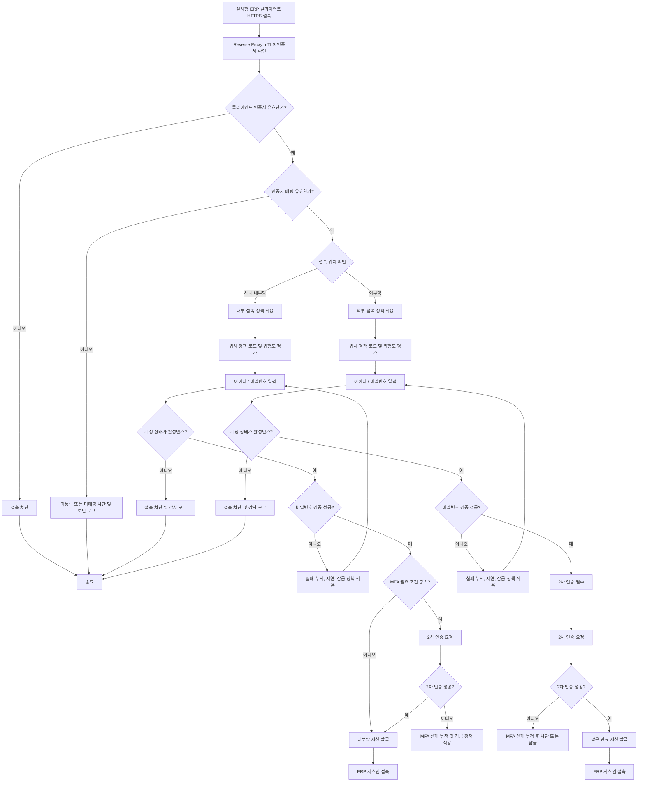

# 로그인 인증

태그: `#erp` `#domain/security` `#topic/authentication` `#doc/policy`

상위 문서: [문서 지도](../00-index.md)  
이전 문서: [시스템 아키텍처](../architecture/01-system-architecture.md)  
다음 문서: [사용자 관리](03-user-management.md)

문서 위치: [문서 지도](../00-index.md) > 보안 > 로그인 인증

관련 문서:
- [보안 운영 요약](01-security-operations-summary.md)
- [시스템 아키텍처](../architecture/01-system-architecture.md)
- [사용자 관리](03-user-management.md)
- [권한 모델](04-permission-model.md)
- [개발 워크플로우](../01-development-workflow.md)

## 1. 목적

이 문서는 Windows 설치형 ERP 클라이언트의 로그인 및 사용자 인증 처리 방식을 정의한다.

## 2. 인증 대상

- 관리자
- 일반 사용자
- 운영 담당자

## 3. 업무 개요

- 시작 조건: 사용자가 Windows 설치형 ERP 클라이언트를 실행하고 ERP 서버에 HTTPS로 접속한다.
- 종료 조건: 접속 차단 또는 ERP 시스템 세션 발급이 완료된다.
- 주요 담당자: 사용자, 보안 관리자, 시스템 관리자

## 4. 인증 정책 개요

- 사용자가 설치형 ERP 클라이언트로 접속하면 reverse proxy 또는 TLS 계층에서 클라이언트 mTLS 인증서를 먼저 검증한다.
- 인증서가 유효하지 않거나 미등록 또는 미매핑 상태이면 시스템 접속을 차단한다.
- TLS 계층의 인증서 검증이 통과되면 앱 서버는 검증 결과와 인증서 식별 정보를 전달받는다.
- 인증서 검증 통과 후 접속 위치를 확인하여 내부망/외부망 정책을 구분 적용한다.
- 인증은 단말 또는 인증서 신뢰와 사용자 계정 인증을 분리해 검증한다.
- 내부망은 즉시 세션 또는 조건부 MFA 정책을 적용하고, 외부망은 TOTP MFA 필수 정책을 적용한다.
- 외부망 계정이 MFA 미등록 상태이면 로그인 완료 전에 셀프 등록 플로우로 보낸다.
- 외부망 세션은 내부망보다 더 짧은 만료 시간을 사용한다.
- 세션은 인증서 또는 단말 정보에 바인딩되며 폐기 또는 비활성 이벤트 발생 시 강제 종료한다.

## 5. 로그인 인증 흐름도

## 6. 단계별 인증 흐름

### 6.1 공통 선행 검증

1. 사용자가 설치형 ERP 클라이언트를 실행하고 HTTPS로 접속
2. TLS 계층에서 클라이언트 인증서 제출 및 검증
3. reverse proxy가 인증서 검증 결과를 앱 서버에 전달
4. 앱 서버가 인증서 매핑 검증
5. 접속 위치 판별
6. 위치 정책 로드
7. 사용자 ID 및 비밀번호 입력
8. 계정 상태 및 잠금 상태 검증
9. 비밀번호 실패 횟수 검증
10. MFA 등록 여부 및 MFA 필요 여부 판단
11. 세션 발급 또는 차단

### 6.2 내부망 인증 흐름

1. 내부 접속 정책 적용
2. 인증서와 단말 매핑이 유효해야 다음 단계로 진행한다.
3. 아이디 및 비밀번호 입력 후 계정 상태가 `활성`인지 확인한다.
4. 비밀번호 실패 시 실패 횟수 누적, 지연, 잠금 정책을 적용한다.
5. 아래 조건 중 하나라도 충족하면 MFA를 수행한다.
6. MFA 성공 또는 MFA 불필요 시 내부망 세션을 발급한다.
7. 민감 기능 진입 시 재인증 정책을 추가 적용할 수 있다.

### 6.3 외부망 인증 흐름

1. 외부 접속 정책 적용
2. 등록된 단말 또는 승인된 인증서만 로그인 시도를 허용한다.
3. 아이디 및 비밀번호 입력 후 계정 상태가 `활성`인지 확인한다.
4. 비밀번호 실패 시 실패 횟수 누적, 지연, 잠금 정책을 적용한다.
5. 외부망은 항상 MFA를 수행한다.
6. MFA가 아직 등록되지 않은 계정은 셀프 등록 화면으로 이동한다.
7. MFA 실패 시 더 엄격한 제한 정책을 적용한다.
8. 성공 시 외부망 전용 짧은 만료 세션을 발급한다.

## 7. 구현 체크리스트

- [ ] reverse proxy 또는 TLS 계층의 클라이언트 인증서 제출 경로를 구현한다.
- [ ] 인증서 만료, 폐기, 신뢰 체인, 발급 정책 검증 로직을 구현한다.
- [ ] 인증서와 사용자 또는 단말 매핑 검증 로직을 구현한다.
- [ ] TLS 계층의 인증서 검증 결과를 앱 서버 컨텍스트로 전달하는 경로를 구현한다.
- [x] 내부망과 외부망 판별 로직을 구현한다.
- [x] 계정 상태와 잠금 상태 확인 게이트를 구현한다.
- [x] 외부망 MFA 강제 정책을 구현한다.
- [x] 사용자 셀프 MFA 등록 플로우를 구현한다.
- [x] 비밀번호 실패 5회 잠금 정책을 구현한다.
- [x] 로그인 성공, 실패, 잠금, MFA 등록/검증, 로그아웃 감사 로그를 구현한다.
- [ ] 인증서 폐기, 계정 비활성, 권한 박탈 시 세션 강제 종료를 운영 연동과 함께 구현한다.

## 8. 계정 상태 기준

- `활성`: 정상 로그인 가능
- `잠금`: 로그인 실패 횟수 초과 또는 관리자 잠금 상태
- `비활성`: 퇴사, 휴직, 사용 중지 등으로 로그인 불가
- `승인대기`: 계정은 생성됐지만 아직 사용 승인 전 상태

## 9. 입력 정보와 출력 정보

### 9.1 입력 정보

TLS 계층 또는 reverse proxy 입력 정보:

- 클라이언트 인증서
- 인증서 검증 결과
- 인증서 fingerprint
- 인증서 subject

애플리케이션 입력 정보:

- 접속 위치 정보
- 단말 식별자
- 사용자 아이디
- 비밀번호
- 2차 인증 코드
- MFA 등록용 TOTP secret 및 검증 코드

### 9.2 출력 정보

- 로그인 성공 또는 실패 결과
- 세션 정보
- 접속 이력
- 실패 횟수 및 제한 상태

## 10. 인증서 정책

### 10.1 인증서 검증 기준

- 인증서 만료 여부 확인
- 인증서 폐기 여부 확인
- 신뢰 체인 유효성 확인
- 허용된 발급 정책 여부 확인

### 10.2 인증서 매핑 기준

- 인증서는 사용자 계정 또는 승인된 단말에 매핑돼야 한다.
- 허용된 조직, 단말, 사용자 그룹에 속한 인증서만 통과시킨다.
- 유효하지만 미등록 또는 미매핑된 인증서는 즉시 차단한다.
- 공유 인증서는 허용하지 않는다.

### 10.3 인증서 운영 원칙

- 폐기, 분실, 퇴사 발생 시 인증서를 즉시 무효화한다.
- 인증서 폐기 시 활성 세션을 즉시 종료한다.
- 인증서 발급, 갱신, 폐기 이력은 감사 대상이다.

## 11. MFA 필요 조건

| 구분 | MFA 조건 |
| --- | --- |
| 내부망 | 관리자 계정 |
| 내부망 | 승인 권한 보유 계정 |
| 내부망 | 신규 단말 또는 신규 인증서 |
| 내부망 | 최근 실패 이력 존재 |
| 내부망 | 비정상 시간대 로그인 |
| 내부망 | 정책 변경 후 첫 로그인 |
| 외부망 | 항상 MFA 필수 |

## 12. 실패 제한 정책

| 항목 | 내부망 | 외부망 |
| --- | --- | --- |
| 비밀번호 실패 잠금 기준 | 5회 누적 시 잠금 | 5회 누적 시 잠금 |
| MFA 실패 잠금 기준 | 감사 로그만 기록, 잠금은 후속 단계 | 감사 로그만 기록, 잠금은 후속 단계 |
| 실패 처리 | 지연 적용 후 재시도 허용 | 지연 및 접속 제한 적용 |
| 추가 통제 | 위험도 기반 MFA 강화 | 단말 또는 IP 기준 추가 차단 가능 |

## 13. 세션 정책

| 항목 | 내부망 | 외부망 |
| --- | --- | --- |
| 인증 요소 | 인증서 + ID/비밀번호 + 조건부 MFA | 인증서 + ID/비밀번호 + MFA |
| 유휴 만료 | 30분 | 10분 |
| 절대 만료 | 8시간 | 2시간 |
| 동시 세션 제한 | 정책에 따라 허용 | 사용자당 1개 |
| 세션 바인딩 | 인증서 또는 단말 정보에 바인딩 | 인증서 또는 단말 정보에 바인딩 |

세션 발급 시 포함 기준:

- 사용자 ID
- 역할
- 접속 위치
- 인증 강도
- 인증서 식별자
- 단말 식별자
- 발급 시각
- 절대 만료 시각

세션 통제 원칙:

- 로그아웃 시 세션을 즉시 만료 처리한다.
- 장시간 미사용 시 유휴 만료를 적용한다.
- 인증서 폐기, 계정 비활성, 권한 박탈 시 세션을 강제 종료한다.
- 민감 기능 진입 시 재인증을 요구할 수 있다.

## 14. 보안 정책

- 클라이언트 인증서는 접속 전 단계에서 필수 검증한다.
- 앱 서버와 프런트엔드는 인증서 원문 대신 TLS 계층이 전달한 검증 결과만 신뢰한다.
- 내부망과 외부망에 대해 서로 다른 인증 강도를 적용한다.
- 외부망은 2차 인증을 반드시 수행해야 한다.
- 로그인 실패 및 인증 실패 이력을 기록한다.
- 인증 실패 재시도 횟수 제한 정책을 적용한다.
- 외부망 세션은 짧은 만료 시간을 적용한다.
- 로그아웃 시 세션을 즉시 만료 처리한다.
- 인증서와 계정 또는 단말의 매핑이 검증돼야만 로그인 흐름을 계속한다.
- 위험도 평가 결과에 따라 MFA 강도를 조정할 수 있다.

## 15. 감사 로그 이벤트

- 로그인 성공
- 비밀번호 실패
- MFA 실패
- 계정 잠금 발생
- 인증서 미매핑 차단
- 비상 예외 로그인 승인
- 세션 강제 종료

## 16. 예외 및 비상 절차

- 인증서가 만료되었거나 폐기된 경우 즉시 접속을 차단한다.
- 계정이 잠금 상태면 관리자 해제 전까지 로그인을 금지한다.
- 2차 인증 장애가 발생한 경우에도 일반 사용자 임의 우회는 허용하지 않는다.
- MFA 서비스 장애가 공식 확인된 경우에만 비상 예외 로그인을 검토한다.
- 비상 예외 로그인은 보안 관리자 또는 지정 관리자 승인을 받아야 한다.
- 승인 대상은 사전 지정된 운영 핵심 계정으로 제한한다.
- 비상 예외 로그인은 단일 세션, 짧은 만료, 전체 감사 로그 기록을 필수로 한다.
- 장애 종료 후 즉시 예외 허용을 종료한다.
- 외부망에서 반복 실패가 발생하면 IP 또는 단말 기준 추가 차단 정책을 적용할 수 있다.

## 17. 테스트 및 검증 시나리오

- 유효하지 않은 인증서는 로그인 시도 즉시 차단한다.
- 유효하지만 미등록 또는 미매핑된 인증서는 차단하고 감사 로그를 남긴다.
- 내부망 일반 사용자는 조건 충족 시 인증서와 ID 또는 비밀번호만으로 로그인 가능하다.
- 내부망 관리자 또는 승인 권한 계정은 MFA를 강제한다.
- 외부망 사용자는 항상 MFA를 거쳐야 한다.
- 비밀번호 실패 누적 5회 시 계정을 잠금 처리한다.
- 내부망 MFA 실패 누적 5회 시 계정을 잠금 처리한다.
- 외부망 MFA 실패 누적 3회 시 차단 또는 잠금 정책을 적용한다.
- `승인대기`, `잠금`, `비활성` 계정은 로그인할 수 없다.
- 인증서 폐기 후 기존 세션은 즉시 강제 종료된다.
- 로그아웃 후 기존 세션 재사용은 불가능해야 한다.
- 비상 예외 로그인은 승인된 핵심 계정에만 단일 세션으로 허용된다.
- 로그인 성공, 실패, 잠금, 비상 예외 승인 이벤트는 모두 감사 로그에 남아야 한다.

## 18. 연계 포인트

- 계정 활성 여부와 상태값 기준은 [사용자 관리](03-user-management.md) 문서를 따른다.
- 로그인 성공 후 기능 범위 결정은 [권한 모델](04-permission-model.md) 문서를 따른다.
- 개발 반영 절차는 [개발 워크플로우](../01-development-workflow.md)와 연결된다.

## 19. 향후 보완 항목

- 인증서 갱신 및 폐기 절차
- 2차 인증 수단 상세화
- 비밀번호 재설정 절차
- 이상 접속 탐지 및 관리자 알림
