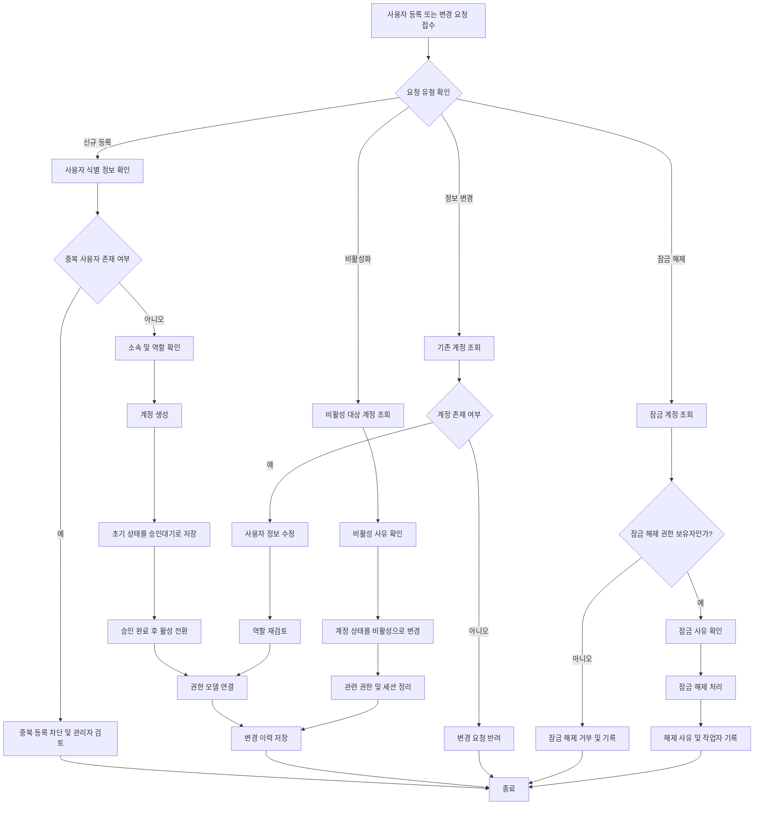
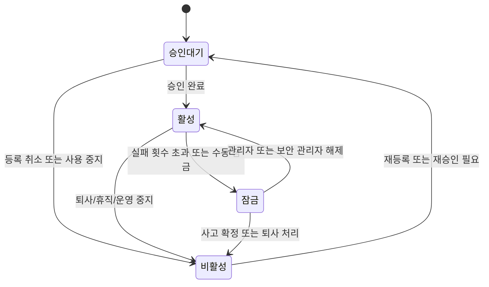

# 사용자 관리

태그: `#erp` `#domain/security` `#topic/user-management` `#doc/policy`

상위 문서: [문서 지도](../00-index.md)  
이전 문서: [로그인 인증](02-login-authentication.md)  
다음 문서: [권한 모델](04-permission-model.md)

문서 위치: [문서 지도](../00-index.md) > 보안 > 사용자 관리

관련 문서:
- [보안 운영 요약](01-security-operations-summary.md)
- [로그인 인증](02-login-authentication.md)
- [권한 모델](04-permission-model.md)
- [개발 워크플로우](../01-development-workflow.md)

## 1. 목적

이 문서는 ERP 사용자 계정의 생성, 수정, 비활성화 절차를 정의한다.

## 2. 업무 개요

- 시작 조건: 신규 사용자 등록, 정보 변경, 상태 변경 요청이 발생한다.
- 종료 조건: 계정 정보와 상태가 정책에 맞게 반영된다.
- 주요 담당자: 시스템 관리자, 부서 관리자, 보안 관리자

## 3. 사용자 유형

- 관리자
- 일반 사용자
- 부서 담당자

## 4. 관리 항목

- 계정 생성
- 사용자 정보 수정
- 비밀번호 초기화
- 계정 비활성화

## 5. 사용자 관리 흐름도

## 6. 구현 체크리스트

- [ ] 신규 사용자 등록 시 중복 사용자 검증을 구현한다.
- [ ] 사용자 소속 및 역할 확인 절차를 구현한다.
- [ ] 신규 계정 기본 상태를 `승인대기`로 저장한다.
- [ ] 승인 완료 후 `활성` 전환 절차를 구현한다.
- [ ] 계정 변경 시 역할 재검토와 권한 모델 재연결을 구현한다.
- [ ] 비밀번호 또는 MFA 실패 누적 시 `잠금` 전환을 구현한다.
- [ ] 잠금 해제 권한 검증과 해제 이력 기록을 구현한다.
- [ ] 비활성 전환 시 관련 권한 및 세션 정리 절차를 구현한다.
- [ ] 상태 변경 이력을 감사 로그와 연결한다.

## 7. 계정 상태 모델

- `승인대기`: 등록 직후, 사용 승인 전 상태
- `활성`: 로그인 가능 상태
- `잠금`: 반복 실패, 이상 행위, 수동 잠금 상태
- `비활성`: 퇴사, 장기 미사용, 운영 중지 상태

## 8. 계정 상태 전이도

## 9. 운영 규칙

- 사용자 식별 기준
- 중복 계정 방지
- 퇴사자 계정 처리
- 변경 이력 관리
- 로그인 실패에 따른 잠금 및 해제 이력을 관리한다.

## 10. 입력 정보와 출력 정보

### 10.1 입력 정보

- 사용자 성명
- 소속 부서
- 직무 또는 역할
- 연락처
- 계정 상태 변경 사유

### 10.2 출력 정보

- 사용자 계정
- 계정 상태
- 역할 매핑 정보
- 변경 이력

## 11. 운영 절차

1. 사용자 등록 요청 접수
2. 소속과 역할 확인
3. 계정 생성 또는 정보 변경
4. 권한 모델과 연결
5. 승인 후 활성 상태 반영
6. 변경 이력 저장

## 12. 잠금 및 해제 절차

1. 비밀번호 또는 MFA 실패가 정책 기준을 넘으면 계정을 `잠금` 상태로 전환한다.
2. 잠금 사유, 발생 시각, 누적 실패 정보, 처리 대상 계정을 기록한다.
3. 잠금 해제는 관리자 또는 보안 관리자만 수행한다.
4. 잠금 해제 시 해제 사유와 작업자를 기록한다.
5. 퇴사, 분실, 보안 사고가 확인된 계정은 잠금 대신 `비활성` 전환을 우선 검토한다.

## 13. 예외 상황

- 동일한 사용자 식별 정보가 이미 존재하면 중복 계정 생성 금지
- 퇴사 또는 휴직자는 즉시 비활성 또는 잠금 상태 전환
- 부서 이동 시 기존 권한을 재검토한 뒤 역할을 재설정
- 장기 미사용 계정은 주기적으로 비활성 후보로 검토

## 14. 연계 포인트

- 로그인 인증 단계에서 사용할 계정 상태 기준을 정의한다.
- 권한 모델 문서와 연결하여 역할별 접근 범위를 함께 관리한다.
- 사용자 생성, 변경, 비활성화 이력은 운영 감사 기준과 연계한다.

## 15. 향후 보완 항목

- 승인 기반 사용자 등록
- 사용자 활동 감사 로그
