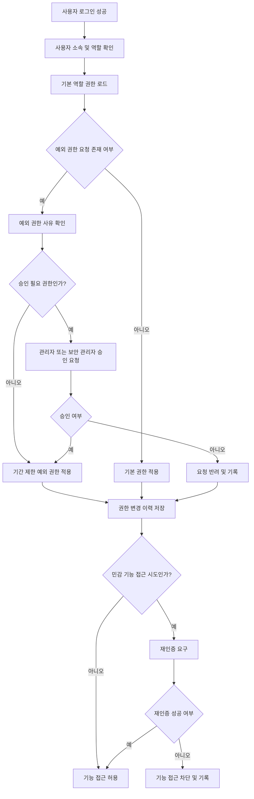

# 권한 모델

태그: `#erp` `#domain/security` `#topic/authorization` `#doc/policy`

상위 문서: [문서 지도](../00-index.md)  
이전 문서: [사용자 관리](03-user-management.md)  
다음 문서: [보안 구현 우선순위](05-security-implementation-priority.md)

문서 위치: [문서 지도](../00-index.md) > 보안 > 권한 모델

관련 문서:
- [보안 운영 요약](01-security-operations-summary.md)
- [로그인 인증](02-login-authentication.md)
- [사용자 관리](03-user-management.md)
- [시스템 아키텍처](../architecture/01-system-architecture.md)
- [수리 진행 워크플로우](../workflows/02-repair-process-workflow.md)
- [재고 워크플로우](../workflows/05-inventory-workflow.md)

## 1. 목적

이 문서는 ERP 시스템의 권한 체계를 정의한다.

## 2. 업무 개요

- 시작 조건: 사용자 역할 정의 또는 권한 변경 요청이 발생한다.
- 종료 조건: 역할과 기능 권한이 시스템에 반영된다.
- 주요 담당자: 시스템 관리자, 보안 관리자, 부서 관리자

## 3. 권한 구성 단위

- 역할
- 기능
- 데이터 접근 범위
- 부서와 권한은 분리한다. 부서는 조직 소속이고, 권한은 기능 접근 범위다.

## 4. 권한 모델

- 관리자 권한
- 부서별 권한
- 읽기/쓰기/승인 권한

## 5. 권한 적용 흐름도

## 6. 구현 체크리스트

- [ ] 사용자 로그인 성공 후 역할 확인 로직을 구현한다.
- [ ] 역할별 기본 권한 로드 로직을 구현한다.
- [ ] 예외 권한 요청 사유와 기간 입력을 구현한다.
- [ ] 승인 필요 권한에 대해 관리자 또는 보안 관리자 승인 절차를 구현한다.
- [ ] 권한 변경 이력 저장 로직을 구현한다.
- [ ] 민감 기능 접근 시 재인증 요구 로직을 구현한다.
- [ ] 재인증 실패 시 기능 접근 차단 및 기록을 구현한다.
- [ ] 임시 권한 만료 시 자동 회수 또는 운영 점검 절차를 구현한다.

## 7. 기본 역할 예시

- 시스템 관리자: 전체 관리, 사용자 관리, 권한 관리
- 서비스 담당자: 수리 접수, 수리 진행 조회 및 처리
- 영업 담당자: 견적, 주문, 부품 판매 처리
- 물류 담당자: 출하, 재고 이동, 입출고 처리
- 회계 담당자: 청구, 수금, 정산 처리
- 조회 사용자: 제한된 읽기 전용 기능 사용

현재 구현 기준 예시 역할:

- `SYSTEM_ADMIN`
- `CUSTOMER_MANAGE`
- `ORDER_MANAGE`
- `WORK_MANAGE`
- `INVENTORY_VIEW`
- `STAFF_VIEW`
- `PARTS_SALES`

## 8. 권한 수준

- 조회: 데이터 열람만 가능
- 등록: 신규 데이터 생성 가능
- 수정: 기존 데이터 변경 가능
- 승인: 예외 처리, 가격 승인, 상태 확정 가능
- 관리: 사용자 및 시스템 설정 변경 가능

## 9. 민감 기능 재인증 대상

- 사용자 관리
- 권한 변경
- 승인 권한 행사
- 대량 데이터 처리
- 보안 정책 변경

## 10. 기능별 권한 매트릭스

| 기능 영역 | 시스템 관리자 | 서비스 담당자 | 영업 담당자 | 물류 담당자 | 회계 담당자 | 조회 사용자 |
| --- | --- | --- | --- | --- | --- | --- |
| 로그인 및 기본 메뉴 | 조회 | 조회 | 조회 | 조회 | 조회 | 조회 |
| 사용자 관리 | 관리 | 없음 | 없음 | 없음 | 없음 | 없음 |
| 권한 관리 | 관리 | 없음 | 없음 | 없음 | 없음 | 없음 |
| 수리 접수 | 조회/등록/수정 | 조회/등록/수정 | 조회 | 없음 | 조회 | 조회 |
| 수리 진행 | 조회/등록/수정/승인 | 조회/등록/수정 | 없음 | 없음 | 조회 | 조회 |
| 견적 및 주문 | 조회/등록/수정/승인 | 조회 | 조회/등록/수정 | 조회 | 조회 | 조회 |
| 부품 판매 | 조회/등록/수정/승인 | 조회 | 조회/등록/수정 | 조회 | 조회 | 조회 |
| 재고 조회 | 조회 | 조회 | 조회 | 조회 | 조회 | 조회 |
| 재고 입출고 및 조정 | 조회/승인 | 조회 | 없음 | 조회/등록/수정 | 없음 | 없음 |
| 출하 처리 | 조회/승인 | 없음 | 조회 | 조회/등록/수정 | 조회 | 조회 |
| 청구서 발행 및 수금 | 조회/승인 | 없음 | 조회 | 없음 | 조회/등록/수정/승인 | 조회 |
| 감사 로그 조회 | 조회 | 없음 | 없음 | 없음 | 없음 | 없음 |

기본 적용 원칙:

- `승인` 권한은 일반 입력 권한과 분리해 운영한다.
- `관리` 권한은 시스템 관리자에게만 부여한다.
- 조회 사용자는 업무 데이터 열람만 가능하고 등록, 수정, 승인 권한은 부여하지 않는다.
- 운영상 예외 권한이 필요한 경우 기간, 사유, 승인자를 함께 기록한다.
- 특정 기능 접근은 부서가 아니라 역할로 열 수 있다. 예를 들어 `STAFF_VIEW` 권한이 있으면 관리부 소속이 아니어도 직원관리 탭을 볼 수 있다.
- 일반 클라이언트의 업무 탭은 기본적으로 역할 기반으로 노출한다.
  - `고객관리`: `CUSTOMER_MANAGE`
  - `주문관리`: `ORDER_MANAGE` 또는 `PARTS_SALES`
  - `공사관리`: `WORK_MANAGE`
  - `자산관리`: `CUSTOMER_MANAGE` 또는 `INVENTORY_VIEW`
  - `부품관리`: `INVENTORY_VIEW`
  - `청구관리`: `INVOICE_MANAGE` 기준으로 설계하며, 프론트 시연 단계에서는 `ORDER_MANAGE` 또는 `PARTS_SALES`도 임시 노출할 수 있다.
  - `직원관리`: `STAFF_VIEW` 또는 `관리부`

## 11. 적용 원칙

- 최소 권한 원칙
- 역할 기반 접근 제어
- 권한 변경 이력 관리
- 민감 기능은 로그인 완료 후에도 재인증을 요구할 수 있다.

## 12. 권한 적용 방식

1. 사용자의 소속과 역할을 확인한다.
2. 역할별 기본 권한을 적용한다.
3. 업무별 예외 권한이 필요한지 검토한다.
4. 승인 이력이 필요한 권한은 별도 기록한다.
5. 정기 점검 시 불필요 권한을 회수한다.

## 13. 예외 상황

- 특정 사용자에게 임시 승인 권한이 필요한 경우 기간과 사유를 함께 기록한다.
- 부서 이동 후 예전 권한이 남아 있으면 즉시 회수한다.
- 승인 권한은 일반 입력 권한과 분리해 운영한다.
- 동일 사용자가 등록과 승인 모두 수행하지 않도록 분리 원칙을 검토한다.

## 14. 연계 포인트

- 로그인 인증 성공 후 사용자 역할에 따라 기능 접근 범위를 결정한다.
- 사용자 관리 문서에서 정의한 사용자 유형과 역할 체계를 함께 사용한다.
- 업무 흐름 문서별로 필요한 읽기, 쓰기, 승인 권한을 이 문서 기준으로 세분화한다.
- 로그인 세션 중 민감 기능 진입 시 재인증 정책의 기준 문서로 사용한다.

## 15. 향후 보완 항목

- 세부 기능별 권한 매트릭스
- 예외 권한 승인 프로세스
